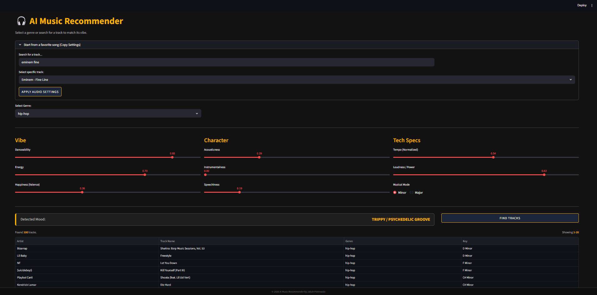

# AI Music Recommender

Intelligent music recommendation application written in **Python** built with **Streamlit**. The system analyzes audio features (energy, danceability, valence) and uses machine learning to find songs that perfectly match the user's **musical taste**.

<p align="center">
  
</p>

## Features

- **Advanced Recommendation Engine** – Uses **Cosine Similarity (PyTorch)** to calculate mathematical distance between user preferences and the song database.
- **Real-time Mood Analysis** – Live classification algorithm that labels the mood (e.g., *Euphoric / Hyper*, *Melancholic*, *Chill*) based on slider adjustments.
- **Track Mirroring** – Search for a favorite song (e.g., *Rihanna - Stay*) and instantly copy its audio attributes to use as a starting point.
- **Hybrid Sorting** – Smart filtering that balances audio similarity with track popularity.

## Tools & Sources

- [Python 3.9+](https://www.python.org/)
- [Streamlit](https://streamlit.io/)
- [PyTorch](https://pytorch.org/)
- [Scikit-learn](https://scikit-learn.org/)
- [Pandas](https://pandas.pydata.org/)
- [Git](https://git-scm.com/)

## Installation & Usage

### 1. Clone the repository

```sh
git clone https://github.com/JacobPi8/ai-music-recommender
cd ai-music-recommender
```

### 2. Setup Environment

It is recommended to use a virtual environment.

#### Windows

```sh
# Create virtual environment
python -m venv .venv

# Activate environment
.\.venv\Scripts\Activate
```

#### macOS / Linux

```sh
# Create virtual environment
python3 -m venv .venv

# Activate environment
source .venv/bin/activate
```

### 3. Install Dependencies

```sh
pip install -r requirements.txt
```

### 4. Run Application

```sh
streamlit run main.py
```

## How to Use

- **Select Genre** – Choose a specific genre or stick with "All Genres".
- **Adjust Sliders** – Tweak the sliders (Energy, Danceability, Valence) to define your desired atmosphere.
- **Start from Track** *(Optional)* – Type a song name (e.g., `Rihanna Stay`) to auto-set the sliders based on that track.
- **Get Recommendations** – Click **FIND TRACKS** to see the list of best-matching songs.